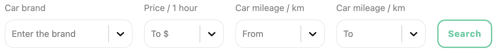

<h1 align="center">Car Rental</h1>
<h3 align="center">Choose a car that suits your needs</h3>

# Docs

- [About](#about)
- [Usage](#usage)
  - [Filters](#filters)
  - [Favorites](#favorites)
  - [Learn more](#learn-more)

# About

- This rental car website offers a wide selection of vehicles, ensuring users can find a car that fits their specific needs.
- The advanced filtering options allow users to search by brand, hourly price, and mileage range, making the selection process quick and efficient.
- Competitive pricing ensures that users get the best value for their money.
- Additionally, the user-friendly interface simplifies the booking process, providing a seamless experience from start to finish.

# Usage

### Filters

- Choose the filters you need

- After that, click the Search button

- Get search data according to your criteria

### Favorites

- You can add the car to your Favorites list by clicking on the heart icon

- If the car is already in your Favorites list, the heart icon will be colored

- After that, the car will appear on the "Favorites" page

### Learn more

- You can view more information about the car by clicking on the "Learn more" button

- In the pop-up window, you can view more information about the car and contact us for an order by clicking on the "Rental car" button

